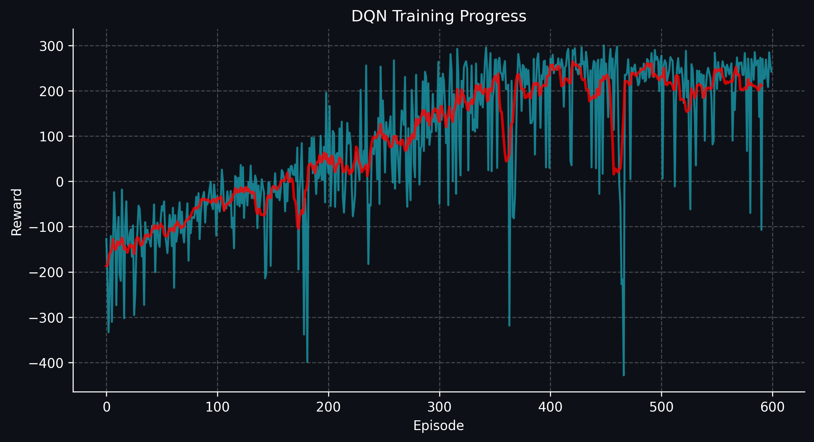
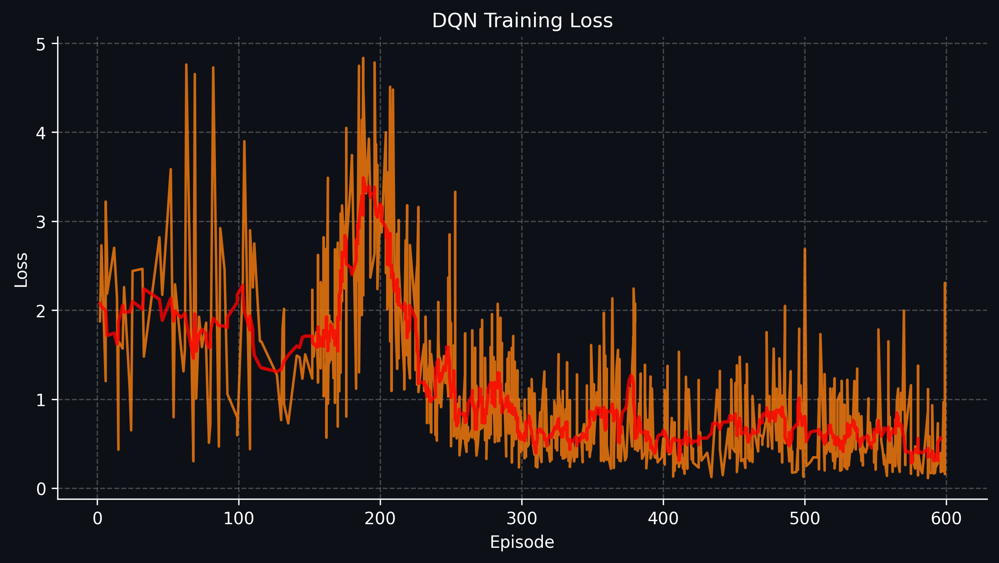

# Deep Q-Network (DQN) for LunarLander-v3

This project trains a Deep Q-Network (DQN) using PyTorch to solve the "LunarLander-v3" environment from Gymnasium.

<p align="center">
  
</p>

## Table of Contents

- [Deep Q-Network (DQN) for LunarLander-v3](#deep-q-network-dqn-for-lunarlander-v3)
  - [Table of Contents](#table-of-contents)
  - [Introduction](#introduction)
  - [Installation](#installation)
    - [Prerequisites](#prerequisites)
  - [Usage](#usage)
    - [Training the Model](#training-the-model)
    - [Running Inference](#running-inference)
  - [Hyperparameters](#hyperparameters)
  - [Training Details](#training-details)
  - [Results](#results)
    - [Trained Model Performance](#trained-model-performance)
  - [LunarLander-v3 Environment](#lunarlander-v3-environment)
    - [Action Space](#action-space)
    - [Observation Space](#observation-space)
    - [Rewards \& Penalties](#rewards--penalties)
    - [Episode Termination](#episode-termination)
  - [References](#references)

## Introduction

The goal of this project is to train an agent using the DQN algorithm to land a spacecraft safely on a designated landing pad in the "LunarLander-v3" environment. The environment is a classic control problem based on Box2D physics, where the agent must optimize its thrusters to achieve a stable landing.

## Installation

### Prerequisites

Ensure you have Python installed. You can set up the required dependencies using:

```bash
# Clone the repository
git clone https://github.com/wtcherr/lunar-lander-dqn.git
cd lunar-lander-dqn

# Create a virtual environment (optional but recommended)
python -m venv venv
source venv/bin/activate  # On Windows use: venv\Scripts\activate

# Install required packages
pip install -r requirements.txt
```

## Usage

### Training the Model

To train the model, run:

```bash
python main.py
```

The training progress can be monitored using TensorBoard:

```bash
tensorboard --logdir=runs
```

### Running Inference

To test the trained model and visualize its performance, run:

```bash
python dqn_inference.py
```

## Hyperparameters

- **Algorithm:** DQN
- **Episodes:** 600
- **Learning Rate:** 0.0001
- **Discount Factor (Gamma):** 0.99
- **Replay Buffer Size:** 10,000
- **Batch Size:** 128
- **Target Update:** Soft Updates (Polyak Averaging), TAU = 0.005
- **Exploration Strategy:** ε-greedy (ε decays from 1.0 to 0.01 with a 0.995 decay factor per episode)
- **Optimizer:** AdamW
- **Loss Function:** Smooth L1 loss

## Training Details

- **Episodes Trained:** 600
- **Convergence Reward:** 200+ (environment considered solved)
- **Hardware:** GPU RTX 3060 Ti (8GB VRAM)
- **Monitoring:** TensorBoard
- **Challenges & Improvements:** Applied in-place gradient clipping (±100) to stabilize training.

## Results

### Trained Model Performance

- The trained model can be found at: `models/dqn_lunar_lander.pth`
- Training reward progress per episode:
  
- Training loss per episode:
  

## LunarLander-v3 Environment

The LunarLander-v3 environment is a reinforcement learning task where an agent controls a lander to safely land on a designated pad. The agent receives rewards based on its landing accuracy and penalties for fuel usage and crashes.

### Action Space

- **Discrete(4)**:
  - `0`: Do nothing
  - `1`: Fire left orientation engine
  - `2`: Fire main engine
  - `3`: Fire right orientation engine

### Observation Space

- **Box(8, float32)**: Contains position, velocity, angle, angular velocity, and landing leg contact status.

### Rewards & Penalties

- Reward increases for smooth and centered landing.
- Penalties for excessive tilt, high speed, and unnecessary thruster use.
- +10 points per leg in contact with the ground, -100 for crashing, +100 for a successful landing.

### Episode Termination

- The lander crashes.
- The lander moves out of bounds.
- The lander stops moving.

For more details, see the official Gymnasium documentation.

## References

- OpenAI Gymnasium: [LunarLander-v3 Documentation](https://gymnasium.farama.org/environments/box2d/lunar_lander/)
- Deep Q-Network (DQN) Paper: [Mnih et al., 2013](https://arxiv.org/abs/1312.5602)
- Pytorch DQN Implementation: [Reinforcement Learning (DQN) Tutorial](https://pytorch.org/tutorials/intermediate/reinforcement_q_learning.html#reinforcement-learning-dqn-tutorial)

---

Feel free to contribute to this project by submitting issues and pull requests!
